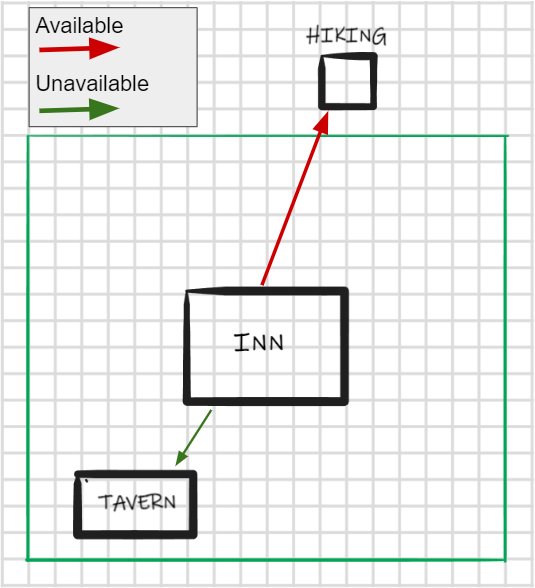
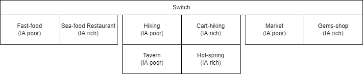
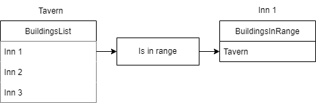

# Voliday Accessibility Feature
## Contexte
During the development of this game, one of the tasks I was given was to create an accessibility zone for residential buildings (inns and castles).

Each residential building has an accessibility zone to allow AIs to access other buildings (restaurants, activities and shops). If a business is not in the accessibility zone of a house, it will not be accessible by the AIs. In summary, homes send AIs, while restaurants, businesses and activities receive them.

There are two types of dwellings, an inn for the poor AIs and a castle for the rich AIs. Each of these have their own types of business, commercial and restaurant buildings. Their code for their accessibility zone works the same way, the only change is the list of buildings that are eligible.

Each dwelling contains a list of buildings that are within its range (BuildingsInRange).

## Implementation of accessibility of activities, restaurants and shops

When an activity, business or restaurant is set up, it goes through a switch to determine what type of building it is.

Once it has determined what type of building it is, it will create a list of buildings that can send it AI (BuildingsList). The poor buildings will make a list of inns and the rich buildings will make a list of castles. Then they will iterate through this list (BuildingsList) to find out if they are in the accessibility zone of these buildings or not. If they are in the accessibility zone of a house, they will add themselves to its list (BuildingsInRange) and set its accessibility boolean to true so that the AIs can go there.

When an activity building, business or restaurant is removed from the island, it will retrieve the list of all residential buildings on the island and remove itself from their list.

## Difficulties encountered
My main difficulty was learning how to use blueprints in Unreal Engine. Its use being very different from lines of code, I had to ask for a lot of help in order to succeed in my programming tasks. The interface is also less intuitive than Unity, which threw me off a lot. For the above task, I had a lot of trouble with the logic of interaction between buildings, I often got lost with the point of view of each building.

## What I learned
I learned to ask for help from my peers, and I am very grateful to them. Learning about blueprints also made me conclude that I don't like this method of game development, and that I will stick to Unity and C# in the future, even though I don't regret learning to use Unreal and blueprints. It opened up another possibility for me to develop a game, even if, as I said, I don't necessarily think I'll use it in the future.

## Conclusion
As I said before, Unreal Engine and its blueprints don't suit me, but I enjoyed seeing something else and confronting a different game engine and a different way of creating games. Especially since this engine is widely used in the industry. Even if I didn't fall in love with the software, it was a useful experience for my professional future.

##### [Return to home page blogposts Voliday](https://sosolamojo.github.io/voliday_folder/blogpost_voliday_home)
##### [Return to home page](https://sosolamojo.github.io/)
