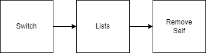

# Voliday Feature Programming
## Accessibility zone

During the development of this game, one of the tasks I was given was to create an accessibility zone for residential buildings (inns and castles).
Each residential building has an accessibility zone to allow AI to access other buildings (restaurants, activities and shops). If a business is not in the accessibility zone of a house, it will not be accessible by AI.
There are two types of dwellings, an inn for the poor AI and a castle for the rich AI. Each of these have their own types of business, commercial and restaurant buildings. Their code for their accessibility zone works the same way, the only change is the list of buildings that are eligible.
Each dwelling contains a list of buildings that are within its range (BuildingsInRange).

When an activity, business or restaurant is set up, it goes through a switch to determine what type of building it is.

Once it has determined what type of building it is, it will create a list of buildings that can send it AI (BuildingsList). The poor buildings will make a list of inns and the rich buildings will make a list of castles. Then they will iterate through this list (BuildingsList) to find out if they are in the accessibility zone of these buildings or not. If they are in the accessibility zone of a house, they will add themselves to its list (BuildingsInRange) and set its accessibility boolean to true so that the AI can go there.

When an activity building, business or restaurant is removed from the island, it will retrieve the list of all residential buildings on the island and remove itself from their list.

##### [Return to home page](https://sosolamojo.github.io/)
