# Post-mortem Lead Game Designer

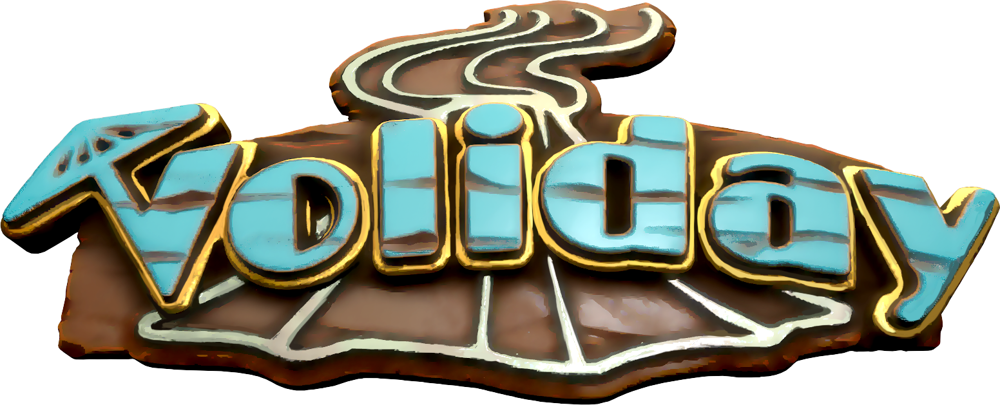

## Context
During the specialization project of the Games Programming section in the Bachelor's year at the SAE Institute in Geneva, we were asked to work on a video game project in a group and in collaboration with students from other sections of the school (game art and audio). The specialization module consists in having a specific role in the development of our group project. For my part, throughout the project, I took on the role of Lead Game Designer but also of substitute Lead UI/UX Designer.

### Constraints
For this project, we had several constraints imposed by our teacher, Elias Farhan:
- We had to create a city builder.
- We had the choice between using the Unreal Engine 4 or creating a custom engine from the Neko Engine, Elias' personal engine.
- The artistic direction that was imposed on us was that of *The Legend of Zelda: Link’s Awakening*.
- The project started in September 2021 and we had to complete it by the end of April 2022.
- The game was to be single player and playable on PC.

We decided to use the Unreal Engine 4, because we didn't think we would be able to develop the game as well as the custom engine, but on the other hand we had to learn how to use a brand new game engine that we had never used before. The other reason was that this engine is widely used in the industry and it was good for us to gain experience on this engine for our future professional experiences.

### Organisation
In order to be able to organize ourselves during the project, we had several means of communication and organization. The first is a discord server, which allows us to exchange information, ask for help and organize appointments. We also used Jira for the organization and distribution of tasks. Finally, we were supposed to use Perforce to share everyone's code, but due to several problems we preferred to use Github, although we used Perforce sporadically during the project.

Throughout the project, to keep up to date and receive feedback, we had two weekly meetings:
- The first was a meeting with the rest of the programming team, as well as the second years when they worked for us and a delegate from the Art and Audio team.
- The second meeting was with Elias.

The team meeting allowed us to exchange information, update each other on what the rest of the team had done during the week, address potential problems, as well as organize ourselves for the meeting with Elias, which often took place the next day.

The meeting with Elias allowed us to get feedback from him, as well as from various outsiders who were present from time to time, so that we could improve our organization, the development of the game and direct us when we had difficulties.

These two meetings allowed us to keep each other informed about the progress of our different tasks, as well as to ask for help from each other or from Elias if necessary. The final advantage of these meetings was that, being weekly, they allowed us to have a certain routine and not to lose track of the project and to stay as up-to-date as possible.

### The teams
For the realization of this project, several teams were formed: the audio team with 6 people, the game art team with 13 artists, the tool team with 7 2nd year game programmers and the programming team with 7 3rd year game programmers.

In our small team of programmers, we all had a specific role:
- Oleg Loshkin is our Project Manager
- William Pepin is our Producer
- Marvin Scharding is our Lead UI/UX Designer
- Lorna Dupuis is our DevOps
- Guillaume Jeannin is our R’n’D
- Vincent Dworak is our Lead Programmeur
- And myself, the Lead Game Designer

### My role
The role of Lead Game Designer was very interesting to have but also very laborious. Having never had this role in my life, it was a challenge to come up with a clear and concise Game Design Document for the whole team, especially in a very short period of time. As the person most interested in management games in my section (in my spare time I love it), the whole class was unanimous in awarding me the role of Lead Game Designer. I was very happy to take on this role, but as the project progressed, I realized the magnitude of the task I was being asked to do.

As Lead Game Designer, I had to set up the game world and gameplay by writing a Game Design Document very quickly to allow the rest of the team to start working on the project. To do this, I played several management games on different themes in order to get inspiration and establish the different mechanics of our game. Once this document was written, I realized that it was not precise enough and that my colleagues did not necessarily read it. So I had to refine it and make it more accessible. One of the ways I found was to use more pictures and diagrams rather than long paragraphs of text, which made the explanations of the different mechanics, for example, more understandable, a subject I will discuss in more detail in another section.

Along with my role as Lead Game Designer, I also had the role of programmer, like my other third year colleagues. I was able to work on a few mechanics, which I talk about in more detail in one of my other blog posts for example, but as my role as Lead Game Designer was a very demanding one, I wasn't able to participate much in the programming, being mostly busy making sure that the game design worked and was respected, that all the teams had the right documentation and that everyone was on the same page for the development of the project.

### Elevator pitch
Voliday is a city builder set on a volcanic island paradise. The objective is to make the island prosper by constructing unique buildings and tourist activities while exploiting the resources of the volcano.

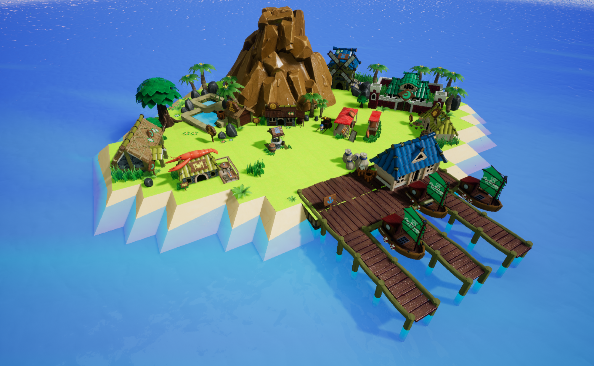

Below you can find the link to the itch page of our game: 
##### [https://volcanoteam.itch.io/](https://volcanoteam.itch.io/)

## Inspirations

### Holiday Island
This game is the one I had in mind as soon as I was given the role of GD. It's an old PC management game that I played as a kid. It has simple mechanics and UI that fit well with the kinds of features I wanted. Especially since the world fit perfectly with our idea of a tourist paradise island but without the volcano.

[https://www.abandonware-france.org/ltf_abandon/ltf_jeu.php?id=1647](https://www.abandonware-france.org/ltf_abandon/ltf_jeu.php?id=1647)

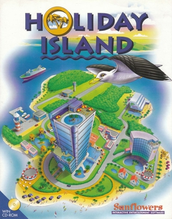

### Tropico 6
Tropico 6 was a discovery following my search for inspiration. Its features are much more complex than the game we wanted to design, but what appealed to me was the placement of the buildings as well as the musical universe, which we were inspired by.

[https://store.steampowered.com/app/492720/Tropico_6/](https://store.steampowered.com/app/492720/Tropico_6/)

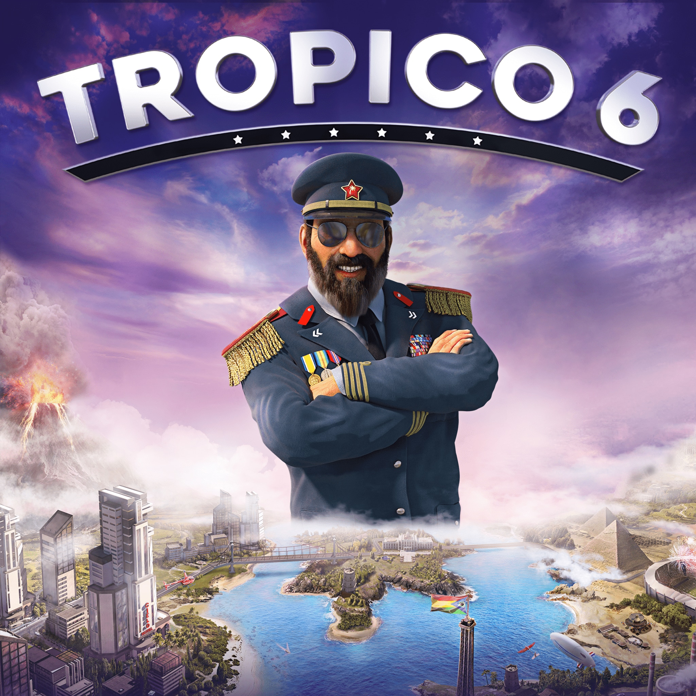

### Parkitect
I spent many hours playing this game, and the main inspiration was the UI, the information contained in each window and the time flow. The mechanics being simple to understand for the player and apparently not too complex to implement, I decided to use them as inspiration for Voliday.

[https://store.steampowered.com/app/453090/Parkitect/](https://store.steampowered.com/app/453090/Parkitect/)

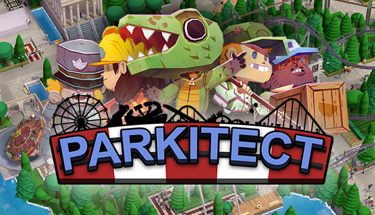

## Collaboration with audios and games art

### Audios
The collaboration with the audio team was a great experience. They didn't have the opportunity during their training to produce audio assets for a video game, but they enjoyed working on Voliday with us, and it's mutual. They did an excellent job and we thank them for that. As GD, I had made them a document with a list of inspirations and another with a list of assets to produce. I really enjoyed being involved in some of the recording sessions with the audio team, especially the sound effects session, which showed me how much work they do and how much ingenuity goes into creating audio assets. It was a very enriching experience, which allowed me to discover another aspect of the creation of a video game, which I didn't necessarily know in my games programming training.

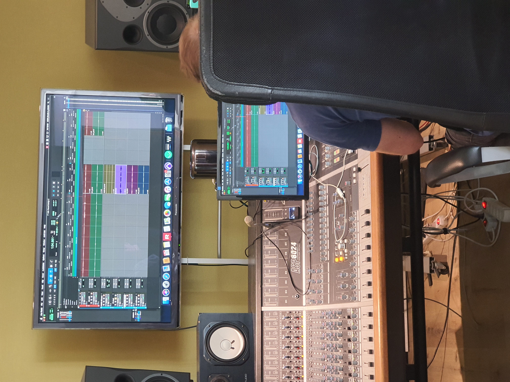

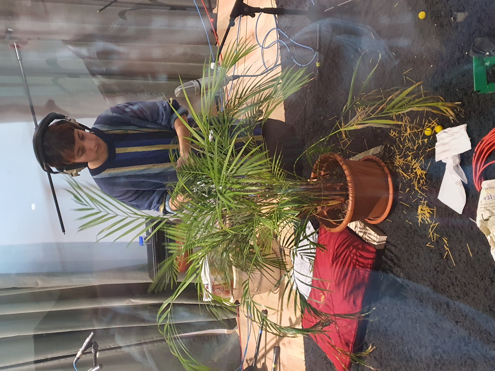

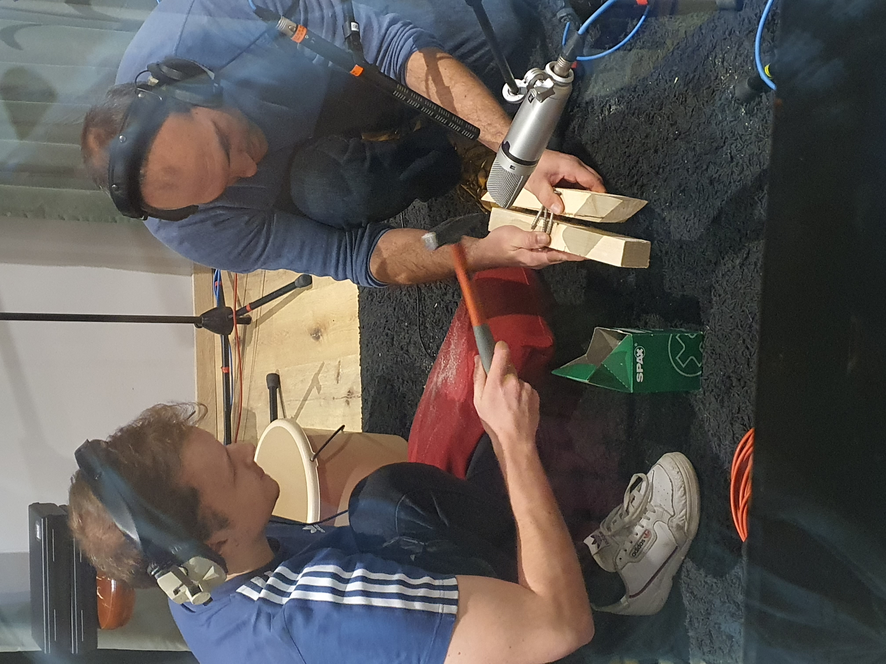

### Games Art
The collaboration with the game artists went very well, even if we gave them a lot of work, it seems that they are happy with the result. As GD, I quickly wrote documents for the artist team to give them the inspirations, illustrating as much as possible each element and each building. Then, together with my classmate Marvin Scharding, we also co-wrote the inspirations and assets expected for each element of the UI.

When writing the different reference documents for Game Arts, I had some difficulties. Coming from a programmer's perspective, it was difficult at first to fully understand what they wanted from these documents, but through perseverance I was able to explain what we wanted from them in a way that was clearer to them. As with my work with the Audio team, having to work and communicate with the Art team was an enlightening experience that forced me to change my perspective and discover another way of approaching the creation of a video game.

## Model
Once the basics of the Game Design Document were established, we made a Lego model to better visualize the island and the size of the buildings. This allowed us to establish a unit of measurement for the artists and the size of each object on the island. We did this because it was difficult for me to get my bearings when creating the Game Design Document and this model allowed me to have a better visual perspective on the design of the document and the game in general.

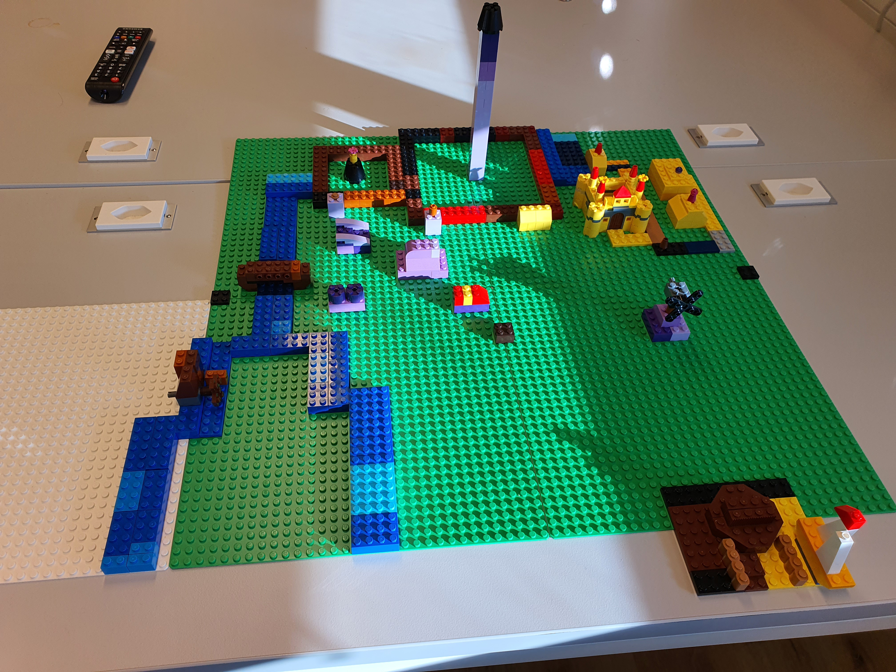

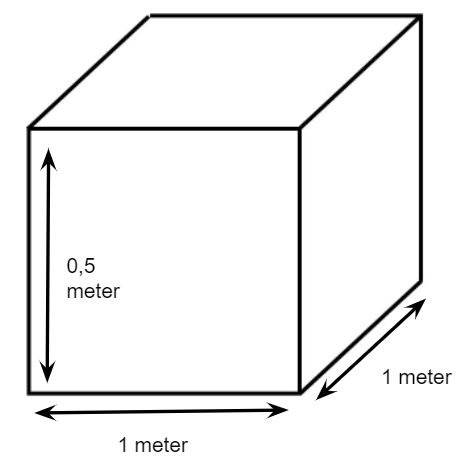

## Mechanics and diagrams
In order to better visualize the mechanics for my teammates, I tried to schematise as much as possible each of them in the Game Design Document. But I also created a presentation with only images and animation, which in the end was much more useful than the above mentioned document. I have detailed as many examples as possible in the Game Design Document, to make sure that the mechanics are really well understood, while being available for any questions from my fellow students.

### Noise zones
Noise zones are produced by all buildings except dwellings. When a house is in the noise zone of another building, it is affected by the nuisance, which displeases the tourists staying in the house and lowers the satisfaction of the RNs (which has an impact on the popularity of the island).

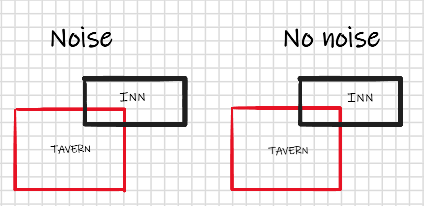

### Water resources provided by water wells
The wells are used to provide water for the operation of the buildings on the whole island (X buildings). The water points are added to the meter in the IU. If the number of buildings exceeds the total water capacity, they do not function and therefore no tourists come.

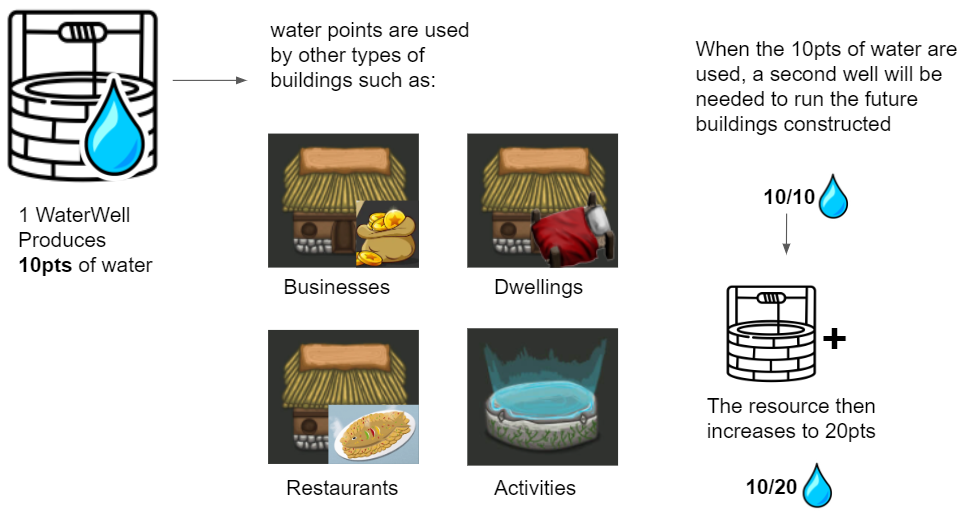

The well produces 10pts of water which will be added to the stock of water resources in the IU. The placement of the wells is up to the player.

**Example:**
On my island I have built a well (which produces 10 water points) as well as an inn (which uses 5 water points) and a tavern (which uses 4 water points). So there are 9 out of 10 water points used on the island.

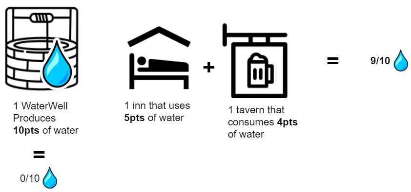

If I add a castle that consumes 8 water points, that makes a total of 17 points out of 10, which is not possible. In this case, the castle will not function and will not be able to welcome visitors to generate income. A mill will have to be added to increase the electricity resource.

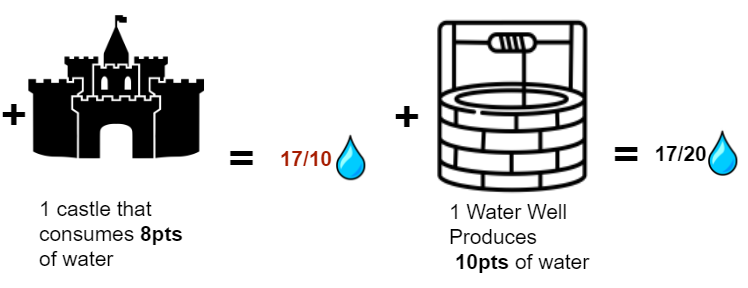

When a building is missing a resource, an icon corresponding to the missing resource is displayed above the building concerned.

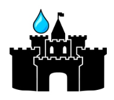

### AI
For the behavior of the AIs, it was more complicated to create diagrams. So I explained their mechanics and function with animations in the Game Design Document. For example, their arrival conditions.

We had two types of AI, the rich and the poor, both of which have different conditions for them to arrive on the island. The rich can come when the popularity of the island reaches 3 stars, the port is present and functional as well as a castle to welcome them and an activity corresponding to them. For the poor, the conditions are similar, i.e. to have a functional port and an inn to lodge, but they do not need to have a certain popularity to arrive on the island. As soon as the player fulfills these two conditions, poor AIs arrive on the island.

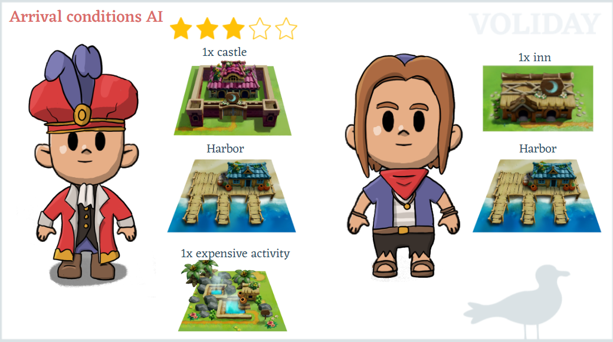

## Difficulties encountered
My main difficulty was to write the GDD and especially to get my teammates to read it. Most of them did not consult the document, either in their own way, which did not necessarily correspond to what was expected, or by asking me questions when everything was in the Game Design Document. This caused problems, such as repeating the same thing several times. Or for example, when the AI satisfaction system was made with two variables, one for satisfaction and one for dissatisfaction. What was expected was to have only one variable, so that the satisfaction icons would be displayed over the AIs according to their satisfaction gauge and not be satisfied and dissatisfied at the same time. So we have two icons displayed instead of one, which is counter-intuitive to the player.

The second difficulty was communication with our project manager, who often tended to overstep on everyone's roles and tasks. I often took on the role of mediator and confidant to ease tensions. Even if there were some hiccups between my project manager and myself, we were always able to talk about them in order to rectify the mistakes made by each of us. It was laborious but constructive.

The third was to mourn the loss of some mechanics. Due to a lack of time we had to cut some features, which undoubtedly made me lose some work time, but which was necessary to make our project on time.

## What I learned
I learned a lot of things during the development of this project, like the fact that the Game Design Document is something to be developed very quickly so that everyone can start working, but most of all that it is not read. The trick is to create a very graphic GDD presentation and present it to everyone so that everyone has a clear vision of what is expected, while remaining available to the team in case of questions. Unclear features can cause a lot of problems, and especially wasted work time.

Asking for regular feedback is also very important, sometimes my vision of certain features was not well thought out and the perspective of my peers was very helpful. In the future I will ask for much more feedback from those around me, even if I do it already, it's never enough.

## Conclusion
The role of Lead Game Designer on this project has largely confirmed that I enjoy being involved in the design of a video game. Although it was laborious, and I would certainly do things differently by anticipating certain aspects, I really enjoyed being part of our team. If I had to do it all over again, I think I would go for the simplest solution at first, as the amount of features we thought of at the beginning of the project was far too large for the MVP, which probably did us a disservice. But it was a great adventure that I would do again without hesitation.

## Acknowledgements
I would like to thank all the people involved in this project, colleagues, outsiders and stakeholders. This project would not have been possible without all these people, who helped us throughout these 8 months of development. Their involvement and support have been invaluable during this beautiful adventure.

PROGRAMMERS TEAM

Oleg Loshkin (Project Chief),
William Pepin (Producer),
Marvin Scharding (Lead UI/UX Design),
Lorna Dupuis (DevOps),
Guillaume Jeannin (R’n’D),
Vincent Dworak (Lead Programmer)

TOOL TEAM

André Silva de Carvalho (Gameplay Values Editor Tool),
Florian Rossignol (Cheating Tool),
Jeffrey Antonelli (Unreal Class Deleter Tool),
Ludo Bernard (DataBase Gameplay Values Tool),
Paul Breuza (Simulator Gameplay Values Tool),
Sandy Woolman (Tile Flag Painter Tool),
Victor Gonnet (Blueprint Assert Node Tool)

AUDIOS TEAM

Alexandre Calvete (Sound Designer),
Christian Légeret (Sound Designer),
Hugo Tavares (Sound Designer),
Julien Bussard (Lead Audio)

GAMES ART TEAM

Anastasia Petcova (Buildings/Props Artist),
Dévran Porchet (Environment Artist),
Emilie Maire (Props Artist),
Julien Kobler (Lead Chara),
Lisa Manolache (Lead Buildings / 2D),
Marie Sobredo (Buildings/Props Artist),
Marion Giovanola (Lead Props),
Mia Calin (Lead 2D / UI et UX),
Nolan Zannato (Buildings / Props Artist),
Raphael Schnegg (Buildings Artist),
Steven Voirol (Environment / Props Artist),
Théotime Millois (Chara Artist),
Tina Dikosavic (Lead Environment)

STAKEHOLDERS

Elias Farhan (Head Games Programming),
Laurent Vonlanthen (Head Audio),
Nicolas Siorak (Head Bachelor),
Nicolas Vallée (Head Game Arts),

MENTORS AND EXTERNALS

Duncan Bourquard,
Fréderic Dubouchet,
Guillaume Laugé,
Luca Floreau,
Nicolas Brière,
Nicolas Schneider,
Philippe Métral,
Sylvain Cardin,
Vincent Tinguely,

THANKS A LOT!

##### [return to home page blogposts Voliday](https://sosolamojo.github.io/voliday_folder/blogpost_voliday_home)
##### [Return to home page](https://sosolamojo.github.io/)
